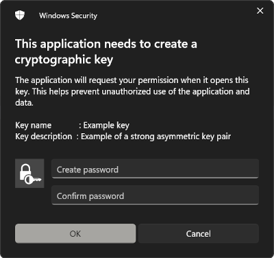
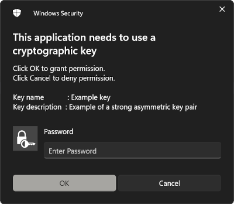

# Signing with asymmetric keys generated using TPM in Windows

This repository contains an example of using Microsoft's
**Cryptography API: Next Generation (CNG)** to create an asymmetric key pair
secured by TPM and sign some data with it.

## Build

Windows SDK is needed for this example to run (works with MSYS2). To build all
executables run

```bash
make all
```

This builds executables which use RSA algorithm for key pair creation. To use
Elliptic Curve Cryptography instead, run

```bash
make all ARGS="-DELLIPTIC"
```

Executables are placed into `bin` directory:

- `crete_key.exe`: Create asymmetric key pair protected by a password.
- `delete_key.exe`: Deletes created key pair.
- `export_key.exe`: Export key pair's public key in PEM format.
- `sign.exe`: Uses created key pair's private key to sign some bytes.

## TPM

Key pairs are created and protected by TPM, whose features are provided by
*Microsoft Platform Crypto Provider*. To use *Microsoft Software Key Storage
Provider* instead of TPM, run

```bash
make all ARGS="-DSOFTWARE"
```

or

```bash
make all ARGS="-DELLIPTIC -DSOFTWARE"
```

## Demo

Executables can be ran by itself or all together as a demonstration by running
script `demo.sh` with Git Bash. This script takes one argument, which can be
`'rsa'`, to run demo using RSA algorithm, or `'ecc'`, to run it using Elliptic
Curve Cryptography.

Demo builds all executables, creates a key pair,

```bash
$ ./demo.sh ecc
> Compiling for ECC ...
> Creating key ...
```



signs some data with its private key,

```bash
> Signing ...
```



and verifies the signature using OpenSSL.

```bash
> Verified OK
```
